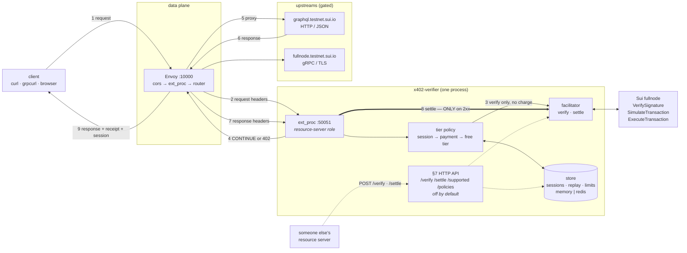
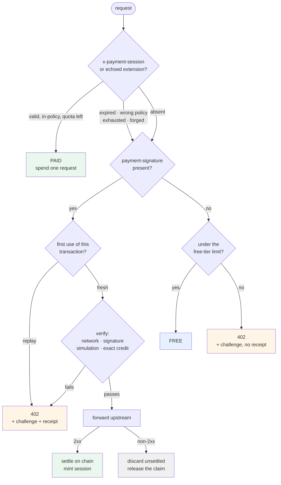

# sui-x402-verifier

Sell API access for stablecoin, at the gateway, without accounts or API keys.

> **This is an experiment.** I built it to find out what putting x402 in front of
> real infrastructure actually costs. The most useful thing it produced is the
> list of things that broke.
>
> Unmaintained, unaudited, and **only ever tested on testnet** — nothing in the
> code restricts it to one, so pointing it at mainnet is a configuration away
> and entirely untried. No support, no roadmap. It is public so the findings and
> the code can be read together.

An [x402](https://github.com/x402-foundation/x402) payment gate written in Rust. It sits
beside an Envoy proxy and decides, per request, whether the caller is on the free
tier or has paid. Anonymous callers get a small rate-limited allowance; when they
exhaust it they receive **HTTP 402 Payment Required** with machine-readable terms
instead of a dead-end 429. Paying in USDC on Sui unlocks a higher-limit session.



**Two things worth reading off that diagram**, because both have caused real
confusion:

1. **Envoy never calls `/verify` or `/settle`.** On the gateway path,
   verification and settlement are in-process calls inside one `ext_proc`
   exchange. The §7 HTTP API is a separate entrance, for *other people's*
   resource servers.
2. **Settlement happens on the response**, after the upstream has succeeded
   (step 8). That is the entire reason `ext_proc` is preferred over `ext_authz`.

A Graphviz version, including the `ext_authz` fallback path, is in
`docs/architecture.dot`.

The demo fronts the Sui testnet itself, so the API being metered and the chain
being paid on are the same network. Nothing above the scheme layer is
Sui-specific.

## What this found

The code is a prototype. These are the parts worth taking somewhere else.

### Simulating a payment does not prove it can still execute

The Sui scheme says to "simulate the transaction to ensure it would succeed and
has not already been executed." Following that literally leaves a hole, measured
on testnet before the fix:

```
1. sign a payment pinning USDC coin 0x3a4d…   →  /verify says isValid: true
2. spend that coin in an unrelated transaction   (Success)
3. /verify again                              →  STILL isValid: true
4. /settle                                    →  invalid argument
```

No race required. Spend the coin first, present the dead authorization, get
verified, get served, watch settlement fail. **Any facilitator that verifies by
simulating alone has this.** The fix reads every pinned input — owned and
receiving inputs plus gas objects — and confirms each still exists at its pinned
version, treating `NotFound` as spent rather than as an RPC error. Shared inputs
are skipped, since consensus versions those at execution.

Honest limit: a gasless payment pins nothing, so the check is a no-op on the
path this gateway is normally paid through. The finding is true of the scheme as
written. [`sui-scheme-conformance.md`](docs/sui-scheme-conformance.md)

### "Gasless" has a cold start that the word hides

Sui's address balances make a payment cost zero gas — but only once funds are
*in* the address balance, and USDC from a faucet, an exchange or an ordinary
transfer arrives as coin objects. Moving it across costs gas. So a payer holding
only stablecoins cannot make their first gasless payment, which is precisely the
agent case the whole approach is aimed at.

Selecting the gasless path on price alone therefore builds a transaction that
cannot execute. The client now probes the address balance and falls through to
coin objects, and reports what every path needed when none work.
[`deployment-architecture.md`](docs/deployment-architecture.md)

### The spec's ordering rules out a whole class of gateway

x402 sequences payment as verify → do the work → settle, so a client is only
charged once the resource exists. That silently excludes every pre-upstream
authorization filter — Envoy's `ext_authz`, NGINX `auth_request`, most gateway
plugin models — because none of them can observe the response.

An implementer reaching for one produces a conformant-*looking* service with the
payment ordering inverted and no indication anything is wrong. `ext_proc` is the
way out: one bidirectional stream per request, so a verified payment is held as
stream-local state and settled on the way out. Proved by a route that always
returns 503 — payment verified, nothing charged.
[`spec-gaps.md`](docs/spec-gaps.md)

### The spec is chain-agnostic in shape and EVM-shaped in content

Six of the fifteen standard error codes are named
`invalid_exact_evm_payload_*`. There is no non-EVM equivalent for any of them,
so a Sui or Solana facilitator rejecting a bad signature has no standard code
for it — everything collapses into `invalid_payload`. §10's replay protection
leans on EIP-3009 contracts enforcing nonce non-reuse on chain, which does not
generalise either. And `maxTimeoutSeconds` has no on-chain expression on Sui,
whose finest expiry is one epoch (~24h).
[`upstream-issues/`](docs/upstream-issues/)

### gRPC had to be framed, because nothing specifies it

The spec defines HTTP, MCP and A2A transports and says nothing about gRPC, where
a non-200 status collapses into an opaque transport error. Denials here are
trailers-only responses carrying `grpc-status: 8`, with `grpc-timeout` injected
so a paid stream cannot outlive its session. Chosen rather than followed.

### Measured, not estimated

Settlement lands on the response path: three payments verified against a 503
upstream left the payee balance unchanged. Live traffic shows verification at
~22ms mean and settlement at ~439ms — which is why one payment buys a session
rather than a request.

The gate's own decision measures 0.3–0.5ms, but **that is a single-host figure**:
Envoy, the verifier and Redis share a network namespace on the demo box, so
every internal hop is loopback and the Envoy↔verifier transit is not in the
number at all. Isolating true gate cost needs a bypass route under identical
load, which has not been done.
[`deployment-architecture.md`](docs/deployment-architecture.md)

## Why a gateway

Most x402 implementations are **middleware you import into an app you control**
— Express, Hono, Next.js, FastAPI, Axum. That only monetizes code you can modify
and redeploy.

Standalone x402 gateways and reverse proxies do exist, and several are further
along than this one on features like dashboards and provider catalogues. What is
different here is narrower, and worth stating precisely rather than claiming a
category:

- **It plugs into a proxy you already run.** `ext_authz`
  and `ext_proc` are standard interfaces, so the same implementation works under
  Envoy and anything whose data plane *is* Envoy — Istio, Gloo, Consul, Envoy
  Gateway, Emissary. Not Kong or APISIX; those are OpenResty-based and have
  their own plugin models rather than these protocols. For anyone running the
  former, the
  difference is adding a filter config rather than adopting another hop.
- **Settlement happens on the response path.** `ext_proc` gives a bidirectional
  stream per request, so the payment is verified on the way in and broadcast
  only after the upstream returns 2xx — the ordering the spec asks for. A
  reverse proxy could buffer to achieve the same thing; as of August 2026 none
  that I could find does.
- **gRPC and grpc-web are gated too.** The spec defines HTTP, MCP and A2A
  transports and nothing for gRPC, so the framing here — trailers-only denials
  carrying `grpc-status: 8` — had to be chosen rather than followed. As of
  August 2026 a public search turned up no other x402 implementation handling
  gRPC; that is a point-in-time observation and the sort of claim that expires.
- **Sui.** Upstream has a Sui *scheme document* and no Sui implementation. This
  was briefly the only working one; a [live Sui facilitator](https://forums.sui.io/t/the-first-live-x402-facilitator-on-sui-agents-pay-usdc-per-api-call-verified-humans-read-free/49391)
  now exists too, so treat "first" claims about Sui as expired.

None of that makes this a product. It is an exploratory prototype, and the most
transferable thing to come out of it is the verification gap documented in
`docs/sui-scheme-conformance.md`.

## Status

| Piece | State |
|---|---|
| Free / paid tiers, 402 challenge, sessions | Working |
| x402 **v2** wire format | Conformant, fixture-tested against the spec's own examples |
| On-chain verification (`sui-grpc`) | Working, validated on testnet |
| On-chain settlement | Working, settled real USDC on testnet |
| Per-route pricing and per-route wallets | Working |
| Redis backend (multi-replica) | Working; exercised in CI, **skipped locally** unless `X402_TEST_REDIS_URL` is set |
| Facilitator API (`/verify`, `/settle`, `/supported`, `/policies`) | Working, off by default |
| Streaming RPCs | **Not metered** — see Limitations |
| Gas sponsorship | Advertised via `extra.gasStation`, not implemented. Unnecessary once a payer's address balance is funded; still the only path for a payer holding stablecoins and no SUI at all |
| `ext_proc` filter | **Default.** Settles after the upstream succeeds |
| `ext_authz` filter | Implemented and unit-tested, **not enabled** in the shipped `envoy.yaml`, not exercised end to end |

182 unit tests, and a 14-check end-to-end script.

```bash
cargo test                                   # 182 unit tests
scripts/e2e-test.sh --real                   # 14 checks, real on-chain payment
```

`--real` builds and signs a transaction with your local `sui` CLI wallet, which
is what `verification_mode: sui-grpc` requires, and **it settles** — real testnet
USDC moves. Without the flag the script sends placeholder bytes, which only a
verifier running `stub-accept-all` will accept; against a `sui-grpc` verifier
the payment steps will fail, correctly.

## Quick start

Needs Rust. Envoy is fetched automatically via [func-e](https://func-e.io) if you
have neither `envoy` nor `func-e` installed.

```bash
scripts/run-local.sh            # builds, starts the verifier + Envoy
scripts/e2e-test.sh             # in another shell
```

By hand — the first five succeed, the sixth is challenged:

```bash
curl -i -X POST localhost:10000/graphql \
  -H 'Content-Type: application/json' \
  -d '{"query":"{ chainIdentifier }"}'
```

```
HTTP/1.1 402 Payment Required
payment-required: eyJ4NDAyVmVyc2lvbiI6MiwiZXJyb3IiOiJmcmVlIHRpZXIg...
```

Base64-decode that header for the terms: `payTo`, `amount`, `asset`, `network`,
`maxTimeoutSeconds`.

### `x402-pay` — the client

When this was written there was no Sui x402 client: the official SDK ships
mechanisms for aptos, avm, evm, stellar and svm, and a GitHub search for x402 +
sui turned up nothing, so a conformant Sui *server* had nothing that could pay
it. That was a point-in-time observation and it has since expired — see the live
Sui facilitator linked above.

```bash
cargo run --bin x402-pay -- http://localhost:10000/graphql \
  -H 'content-type: application/json' \
  -d '{"query":"{ chainIdentifier }"}'
```

```
402 Payment Required
  resource  http://localhost:10000/graphql
  network   sui:testnet
  amount    10 of 0xa1ec7fc0…::usdc::USDC
  payTo     0x908b8519…
  paying as 0x83cb1430…

retrying with payment…
200
  settled  tx HLhwtE5yNTfAMM36oFBG32wqqoNgs8pSmSeAS1XTj5dW on sui:testnet
  session  0x83cb1430…:1785892270:eb7c2dda…
{"data":{"chainIdentifier":"69WiPg3DAQiwdxfncX6wYQ2siKwAe6L9BZthQea3JNMD"}}
```

It does the whole protocol — request, decode the challenge, build a PTB paying
exactly the advertised amount, sign locally, resend — with no `sui` CLI
involved. Keys come from `X402_SUI_PRIVATE_KEY` (a `suiprivkey1…` string) or the
standard CLI keystore, and never leave the machine; only the signature is sent.
`--dry-run` builds and signs without sending.

### Paying for real

`stub-accept-all` accepts well-formed payments without touching the chain, which
is enough to exercise the protocol. To take actual money, set
`verification_mode: sui-grpc` and pay with a wallet-signed transaction:

```bash
scripts/pay-with-sui-cli.sh              # /verify only — simulates, nothing moves
scripts/pay-with-sui-cli.sh --settle     # broadcasts, moves real testnet USDC
scripts/e2e-test.sh --real               # the whole flow with a real payment
```

### Funding a testnet wallet

These drive your local `sui` CLI wallet. No addresses are baked into the repo;
everything is derived at runtime.

| What | Where |
|---|---|
| **Testnet USDC** | [faucet.circle.com](https://faucet.circle.com) — select chain **Sui Testnet**, paste your address. Dispenses 10 USDC |
| Testnet SUI | `sui client faucet`, or [faucet.sui.io](https://faucet.sui.io) |
| Your address | `sui client active-address` |

**You need a little SUI once, then never again.** Payments at or above 0.01 USDC
take the gasless path and cost no SUI — but gasless spends from your *address
balance*, and faucet USDC arrives as coin objects. Moving it across is the
one-off below, and it costs gas.

`x402-pay` handles the case where you have not done that yet: it probes the
address balance and falls back to coin objects rather than building a
transaction that cannot execute. That fallback needs SUI for gas, so doing the
one-off is still the better setup. `--payment-paths` pins a single path if you
want to see one fail rather than fall through.

```bash
# Gasless payments spend from the address balance, not from coin objects.
# This moves 2 USDC across; it costs gas once, and nothing after that does.
COIN=$(sui client objects --json | jq -r \
  '.[] | select(.data.type? // "" | test("usdc::USDC")) | .data.objectId' | head -1)
sui client ptb \
  --split-coins @$COIN "[2000000]" --assign split \
  --move-call 0x2::coin::send_funds "<$USDC_TYPE>" split.0 @$(sui client active-address) \
  --gas-budget 20000000

sui client balance    # `balance` is the total; `coinBalance` is only the coin objects
```

Verified end to end on testnet — a 0.00001 USDC payment through Envoy, settled
only after the upstream succeeded:

```
receipt   {"success":true,"transaction":"wcDro2qkLrmhckT1QAGZefHpBuEw8XNQPB2A42nrof9"}
on chain  checkpoint 368080349, effects.status.success = true
balances  sender 20000000 → 19999990,  payee 0 → 10
```

### Browser demo

```bash
cargo run --bin x402-demo               # then open localhost:8402
```

The page calls `/targets`, `/send`, `/balances` and `/policies` on its own
origin, so it has to be served by `x402-demo` rather than by a static file
server — and `x402-demo` is what holds the hot testnet wallet that pays on a
visitor's behalf. It needs Envoy and the verifier already running; see
`scripts/run-local.sh`.

Drives the whole flow: spend the free tier, watch the decoded challenge appear,
pay, watch calls resume on a session. No build step on the page itself.

## The decision, per request



A failed *payment* returns a receipt; an exhausted *free tier* does not. That is
how a client tells "your payment was rejected, here is why" from "you never
paid".

## Configuration

See `config.example.yaml`. Two values must never be committed, and can come from
the environment instead:

```bash
export X402_SESSION_HMAC_SECRET=$(openssl rand -hex 32)
export X402_PAY_TO=0x<your 64-hex-char Sui address>
```

The example config ships the **zero address**, and the service **refuses to
start** with it — settling there would burn funds, so an unconfigured deployment
fails loudly rather than paying into a hole.

> Full setup reference, including the settings where a plausible mistake gives
> away the paid tier and how to check each one: **[docs/configuring.md](docs/configuring.md)**.

### Pricing routes differently

Envoy names a policy per route; this config says what that policy costs and where
it pays. No path prefixes are repeated across the two files, so they cannot
drift:

```yaml
# envoy.yaml, on the route
metadata:
  filter_metadata:
    envoy.filters.http.ext_proc:
      x402_policy: grpc
```

```yaml
# config.yaml
policies:
  graphql: { amount: "100",  description: "GraphQL queries" }
  grpc:    { amount: "5000", pay_to: "0x…", description: "fullnode gRPC" }
```

**Sessions are scoped to the policy that bought them**, so a session bought on
the cheap route does not unlock the expensive one.

### State backend

```yaml
store:
  backend: memory                      # or: redis
  # redis_url: "redis://127.0.0.1:6379"
```

`memory` is per-process — **run exactly one replica**, or the effective rate
limit becomes N× the configured value and sessions become replica-affine.
`redis` shares state properly; quota spend, replay claims and rate-limit windows
are all Lua scripts, so they stay atomic across replicas. Both fail **closed**.

## The two filters

Which Envoy filter you use decides whether a client can be charged for a request
the upstream then failed to serve.

| Filter | Sequencing | Charged on upstream failure? | Portability |
|---|---|---|---|
| **`ext_proc`** (default) | verify → upstream → settle on 2xx | no | Envoy and Envoy-based meshes; needs a newer Envoy than `ext_authz` |
| `ext_authz` | verify + settle → upstream | **yes** | Envoy and Envoy-based meshes |

Both are Envoy interfaces, so both work under anything whose data plane *is*
Envoy — Istio, Gloo, Consul, Envoy Gateway, Emissary. `deploy/istio-envoyfilter.yaml`
is a working `ext_proc` filter for Istio. Neither works on Kong or APISIX, which
are OpenResty-based and implement neither protocol.

Both are served on the same port, but **only `ext_proc` is enabled in the
shipped `envoy.yaml`**. `ext_authz` is implemented and unit-tested; switching to
it means uncommenting its filter, and it has not been exercised end to end since
`ext_proc` became the default. The per-route `ExtAuthzPerRoute` blocks in
`envoy.yaml` exist for that switch and are inert until it happens.

`ext_authz` is a *pre-upstream* filter: it cannot see the response, so there is
nowhere later to settle from. `ext_proc` gets one bidirectional gRPC stream per
HTTP request, so a verified-but-unsettled payment is held as stream-local state
and settled only after a success.

Both are served on the same port; `envoy.yaml` selects between them. **Do not
enable both** — each would independently charge for the same request.

See **Pay after service** below for what deferring settlement buys, what it
costs, and how to opt out of the tradeoff entirely.

## Pay after service — yes, and it is the default

The Sui scheme sequences payment as **verify → do the work → settle**, so a
client is only charged once the resource has actually been produced. This
implements that, on the `ext_proc` path, which is the default.

Both halves, measured on testnet against a real wallet-signed payment:

```
CASE A — the upstream succeeds
  upstream returned   {"data":{"chainIdentifier":"69WiPg3DAQ…"}}
  receipt             {"success":true,"transaction":"AJ…"}
  payee balance       20300 → 20310        charged AFTER delivery

CASE B — the upstream 404s
  upstream status     HTTP/1.1 404 Not Found
  PAYMENT-RESPONSE    absent               never settled
  x-payment-session   absent               no session issued
  payee balance       20310 → 20310        UNCHANGED, not charged
```

The verifier's own timeline for those two requests:

```
payment verified; settlement deferred until the upstream succeeds
payment settled after the upstream succeeded
upstream did not succeed; discarding the verified payment unsettled  status=404
```

An unsettled payment also has its replay claim **released**, so the client can
retry with the same signed transaction rather than being made to sign a new one
for a failure that was not theirs.

### What this costs you

Deferring settlement moves risk from the client to the server. A Sui payment
authorization pins coin objects at specific *versions*, so in principle a payer
could spend those coins during the window and leave you having served the
resource for nothing.

That window is small, and it is only small because verification rejects
already-dead authorizations — simulation alone does **not** catch spent inputs,
so verification separately checks that every pinned input still exists at its
pinned version. Without that check there was no race at all: spend the coin
first, present the dead payment, get served for free. With it, invalidating a
verified payment means landing a competing transaction inside the
upstream-latency window (~100 ms for a GraphQL query) against roughly 400 ms of
chain finality.

`x402_settlement_after_serve_failures_total` counts this if it ever happens.

**If you would rather not carry that risk at all**, switch to `ext_authz`, which
settles before the upstream runs. There is then no window — the client instead
bears the risk of being charged for a request that later errors, which is how
most paid APIs already behave. Both modes are implemented; `envoy.yaml` selects
between them. That is deliberate.

Note that the exposure is a property of the **spec's ordering**, not of running
at a gateway: in-app middleware doing verify → work → settle has exactly the same
window.

## The facilitator API

`POST /verify`, `POST /settle`, `GET /supported` (spec §7), plus a non-spec
`GET /policies` that reports what each route costs — **disabled unless
`facilitator_api_listen_addr` is set**.

Envoy never calls these. It uses the gateway path above, where verification and
settlement happen as in-process calls. §7 exists so *other people's* resource
servers can delegate Sui work to this service — which is exactly why a facilitator
must never sit in their data path.

Running both roles in one process makes this **self-facilitating**: legitimate,
but there is no trust boundary between the halves. The endpoints are
unauthenticated — bind them to loopback or a private interface. `/settle` is the
one that moves money.

## Observability

Structured logs via `tracing`; set `RUST_LOG=x402_verifier=debug` for
per-decision detail.

Prometheus metrics on `metrics_listen_addr` (off unless set), at `/metrics`:

| Metric | Type | Notes |
|---|---|---|
| `x402_requests_total{tier,decision,policy}` | counter | every authorization decision |
| `x402_payments_total{outcome,code,mode}` | counter | `outcome` = verified / settled / rejected |
| `x402_settlement_seconds` | histogram | on-chain settle latency |
| `x402_verification_seconds` | histogram | verify latency, including fullnode RPC |
| `x402_sessions_total{event}` | counter | created / accepted / rejected |
| `x402_session_rejections_total{reason}` | counter | malformed, expired, wrong policy, exhausted |
| `x402_replay_claims_total{outcome}` | counter | fresh / replay / backend-error |
| `x402_rate_limit_total{outcome}` | counter | allowed / denied |
| `x402_settlement_after_serve_failures_total` | counter | **page on this** — resource delivered unpaid |
| `x402_store_errors_total{store}` | counter | Redis unreachable; requests are failing closed |

The last two are the ones worth alerting on. Everything else is throughput.

## Security model

- **The service holds no keys.** The client signs; settlement re-broadcasts what
  the client already signed. `/supported` reports an empty `signers` map, which is
  how you can verify that claim.
- **The payer is recovered from the signature**, never taken from a client-supplied
  field — which is why the wire type has no `payer`.
- **`use_remote_address: true` is load-bearing.** With Envoy's default the
  downstream address is derived from `x-forwarded-for`, which is the address the
  free tier meters on — any client could rotate the header for an unlimited free
  tier.
- **Identity headers overwrite, never append.** Otherwise a client sends
  `x-x402-tier: paid` and self-promotes.
- **Payments are single-use**, claimed by transaction digest in a store shared
  between the gateway and `/settle`, so one payment cannot be spent through each.
  The claim is keyed on the *decoded* transaction so whitespace variants cannot
  mint fresh keys.
- **Session tokens are `payer:expires:session_id:hmac`**, verified in constant
  time before any field is trusted.
- **Requests with no resolvable source address are denied** — an unmeterable free
  tier is an unmetered one.
- **IPv6 is metered per /64**, since a host delegated a /64 can otherwise iterate
  addresses for an unlimited free tier.

## Limitations

- **Streaming RPCs are effectively unmetered.** A filter fires once per *stream*,
  at headers time. A 20-second `SubscribeCheckpoints` delivering 53 messages cost
  2 authorization checks; a stream held open for hours costs one. The intended fix
  is to price streams by time period rather than per message — per-message
  metering would put the verifier in the data path of every chunk.
- **gRPC reflection and health are not gated.** Clients attach headers to their
  reflection call, so gating it meant the reflection request consumed the payment
  and the real call was then refused as a replay. Reflection is discovery
  metadata, not the paid resource.
- **`maxTimeoutSeconds` is enforced off-chain.** Sui's finest on-chain expiry is
  one epoch (~24h), so a 60-second window has no on-chain expression.
- Out of scope: the Bazaar / discovery endpoints (§8), the `a2a` and `mcp`
  transports, and the interactive gas-station sponsorship protocol.

## Further reading

| | |
|---|---|
| [`docs/how-it-works.md`](docs/how-it-works.md) | **start here** — the shape of the thing, a request end to end, and the questions it gets |
| [`docs/configuring.md`](docs/configuring.md) | setting up Envoy and the verifier, and checking each setting is doing what you think |
| [`docs/deployment-architecture.md`](docs/deployment-architecture.md) | where the verifier runs, what state it needs, and the latency model — including what has *not* been measured |
| [`docs/sui-scheme-conformance.md`](docs/sui-scheme-conformance.md) | line-by-line audit against the Sui `exact` scheme, both payment paths |
| [`docs/settlement-failure.md`](docs/settlement-failure.md) | what happens when settlement fails after the resource was served, and what should be built |
| [`docs/spec-gaps.md`](docs/spec-gaps.md) | where the spec does not say enough to implement from |
| [`docs/architecture.dot`](docs/architecture.dot) | the diagram source |

## Conformance

Wire format follows x402 **v2**, vendored at `docs/spec/upstream/`
(`x402-foundation/x402`). The spec's own JSON examples are extracted into
`tests/fixtures/` and round-tripped through the types, so a shape that drifts
fails CI rather than failing silently against a real client.

Sessions are exposed as a declared extension (§5.1.2) with an `info` and a JSON
`schema`, rather than as an undocumented header. The raw `x-payment-session`
header still works as a deprecated alias.

Conformance against the Sui scheme specifically: `docs/sui-scheme-conformance.md`.
Gaps found in the spec while implementing: `docs/spec-gaps.md` and
`docs/upstream-issues/`. Those are written up in issue form because that was the
clearest way to state them, but nothing there has been or will be filed against
`x402-foundation/x402` — this is a prototype, and each note says so at the top.

## Testing

```bash
cargo test                                                # 182 unit tests
redis-server --port 6399 --daemonize yes
X402_TEST_REDIS_URL=redis://127.0.0.1:6399 cargo test      # + Redis integration
scripts/e2e-test.sh --real                                 # 14 checks, settles on chain
scripts/e2e-test.sh                                        # …placeholder bytes; needs stub-accept-all
```

Redis tests no-op when `X402_TEST_REDIS_URL` is unset, so the suite passes on a
machine without Redis.

## Layout

```
src/
  auth.rs             tier policy; the ext_authz service
  ext_proc.rs         the ext_proc service (settle-after-success)
  breaker.rs          per-policy settlement circuit breaker
  facilitator_api.rs  spec §7 HTTP endpoints
  metrics.rs          Prometheus registry and exporter
  x402.rs             v2 wire types, header codecs, facilitator
  sui.rs              on-chain verification and settlement
  payclient.rs        client-side payment building (gasless and coin-object)
  session.rs          HMAC session tokens, quota, replay cache
  ratelimit.rs        free-tier sliding window
  config.rs           configuration and validation
  bin/x402-pay.rs     the CLI client
  bin/x402-demo.rs    the demo server; holds a hot testnet wallet
```

## License

Apache-2.0
