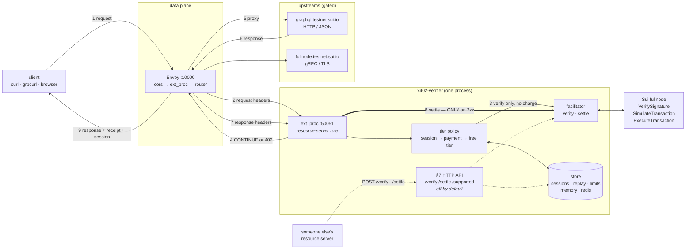

# sui-x402-verifier

Sell API access for stablecoin, at the gateway, without accounts or API keys.

An [x402](https://github.com/x402-foundation/x402) payment gate written in Rust. It sits
beside an Envoy proxy and decides, per request, whether the caller is on the free
tier or has paid. Anonymous callers get a small rate-limited allowance; when they
exhaust it they receive **HTTP 402 Payment Required** with machine-readable terms
instead of a dead-end 429. Paying in USDC on Sui unlocks a higher-limit session.



**Two things worth reading off that diagram**, because both have caused real
confusion:

1. **Envoy never calls `/verify` or `/settle`.** On the gateway path,
   verification and settlement are in-process calls inside one `ext_proc`
   exchange. The §7 HTTP API is a separate entrance, for *other people's*
   resource servers.
2. **Settlement happens on the response**, after the upstream has succeeded
   (step 8). That is the entire reason `ext_proc` is preferred over `ext_authz`.

A Graphviz version, including the `ext_authz` fallback path, is in
`docs/architecture.dot`.

The demo fronts the Sui testnet itself, so the API being metered and the chain
being paid on are the same network. Nothing above the scheme layer is
Sui-specific.

## Why a gateway

Most x402 implementations are **middleware you import into an app you control**
— Express, Hono, Next.js, FastAPI, Axum. That only monetizes code you can modify
and redeploy.

Standalone x402 gateways and reverse proxies do exist, and several are further
along than this one on features like dashboards and provider catalogues. What is
different here is narrower, and worth stating precisely rather than claiming a
category:

- **This is a filter for a proxy you already run, not a new proxy.** `ext_authz`
  and `ext_proc` are standard interfaces, so the same implementation works under
  Envoy, Istio, Kong, APISIX and Gloo. For anyone already running one, the
  difference is adding a filter config rather than adopting another hop.
- **Settlement happens on the response path.** `ext_proc` gives a bidirectional
  stream per request, so the payment is verified on the way in and broadcast
  only after the upstream returns 2xx — the ordering the spec asks for. A
  reverse proxy can buffer to achieve this too, but nothing else appears to.
- **gRPC and grpc-web are gated, not just REST.** A public search finds no other
  x402 implementation that handles gRPC at all, and there is no transport
  binding for it in the spec — see `docs/` for how denials are framed as
  trailers-only responses.
- **Sui.** Upstream has a Sui *scheme document* but no Sui implementation, and a
  public search finds no other one.

None of that makes this a product. It is an exploratory prototype, and the most
transferable thing to come out of it is the verification gap documented in
`docs/sui-scheme-conformance.md`.

## Status

| Piece | State |
|---|---|
| Free / paid tiers, 402 challenge, sessions | Working |
| x402 **v2** wire format | Conformant, fixture-tested against the spec's own examples |
| On-chain verification (`sui-grpc`) | Working, validated on testnet |
| On-chain settlement | Working, settled real USDC on testnet |
| Per-route pricing and per-route wallets | Working |
| Redis backend (multi-replica) | Working, integration-tested |
| Facilitator API (`/verify`, `/settle`, `/supported`) | Working, off by default |
| Streaming RPCs | **Not metered** — see Limitations |
| Gas sponsorship | Advertised only, not implemented |

138 unit tests, plus a 15-assertion end-to-end script that can run against real
on-chain payments.

## Quick start

Needs Rust. Envoy is fetched automatically via [func-e](https://func-e.io) if you
have neither `envoy` nor `func-e` installed.

```bash
scripts/run-local.sh            # builds, starts the verifier + Envoy
scripts/e2e-test.sh             # in another shell
```

By hand — the first five succeed, the sixth is challenged:

```bash
curl -i -X POST localhost:10000/graphql \
  -H 'Content-Type: application/json' \
  -d '{"query":"{ chainIdentifier }"}'
```

```
HTTP/1.1 402 Payment Required
payment-required: eyJ4NDAyVmVyc2lvbiI6MiwiZXJyb3IiOiJmcmVlIHRpZXIg...
```

Base64-decode that header for the terms: `payTo`, `amount`, `asset`, `network`,
`maxTimeoutSeconds`.

### `x402-pay` — the client

There was no Sui x402 client: the official SDK ships mechanisms for aptos, avm,
evm, stellar and svm, and a GitHub search for x402 + sui returns nothing. So a
conformant Sui *server* had nothing that could pay it.

```bash
cargo run --bin x402-pay -- http://localhost:10000/graphql \
  -H 'content-type: application/json' \
  -d '{"query":"{ chainIdentifier }"}'
```

```
402 Payment Required
  resource  http://localhost:10000/graphql
  network   sui:testnet
  amount    10 of 0xa1ec7fc0…::usdc::USDC
  payTo     0x908b8519…
  paying as 0x83cb1430…

retrying with payment…
200
  settled  tx HLhwtE5yNTfAMM36oFBG32wqqoNgs8pSmSeAS1XTj5dW on sui:testnet
  session  0x83cb1430…:1785892270:eb7c2dda…
{"data":{"chainIdentifier":"69WiPg3DAQiwdxfncX6wYQ2siKwAe6L9BZthQea3JNMD"}}
```

It does the whole protocol — request, decode the challenge, build a PTB paying
exactly the advertised amount, sign locally, resend — with no `sui` CLI
involved. Keys come from `X402_SUI_PRIVATE_KEY` (a `suiprivkey1…` string) or the
standard CLI keystore, and never leave the machine; only the signature is sent.
`--dry-run` builds and signs without sending.

### Paying for real

`stub-accept-all` accepts well-formed payments without touching the chain, which
is enough to exercise the protocol. To take actual money, set
`verification_mode: sui-grpc` and pay with a wallet-signed transaction:

```bash
scripts/pay-with-sui-cli.sh              # /verify only — simulates, nothing moves
scripts/pay-with-sui-cli.sh --settle     # broadcasts, moves real testnet USDC
scripts/e2e-test.sh --real               # the whole flow with a real payment
```

These drive your local `sui` CLI wallet. Fund it with testnet USDC at
[faucet.circle.com](https://faucet.circle.com) (chain: **Sui Testnet**) plus a
little SUI for gas via `sui client faucet`. No addresses are baked into the repo;
everything is derived at runtime.

Verified end to end on testnet — a 0.00001 USDC payment through Envoy, settled
only after the upstream succeeded:

```
receipt   {"success":true,"transaction":"wcDro2qkLrmhckT1QAGZefHpBuEw8XNQPB2A42nrof9"}
on chain  checkpoint 368080349, effects.status.success = true
balances  sender 20000000 → 19999990,  payee 0 → 10
```

### Browser demo

```bash
python3 -m http.server 8080 -d demo     # then open localhost:8080
```

Drives the whole flow: spend the free tier, watch the decoded challenge appear,
pay, watch calls resume on a session. Dependency-free, no build step.

## The decision, per request


A failed *payment* returns a receipt; an exhausted *free tier* does not. That is
how a client tells "your payment was rejected, here is why" from "you never
paid".

## Configuration

See `config.example.yaml`. Two values must never be committed, and can come from
the environment instead:

```bash
export X402_SESSION_HMAC_SECRET=$(openssl rand -hex 32)
export X402_PAY_TO=0x<your 64-hex-char Sui address>
```

The example config ships the **zero address**, and the service **refuses to
start** with it — settling there would burn funds, so an unconfigured deployment
fails loudly rather than paying into a hole.

### Pricing routes differently

Envoy names a policy per route; this config says what that policy costs and where
it pays. No path prefixes are repeated across the two files, so they cannot
drift:

```yaml
# envoy.yaml, on the route
metadata:
  filter_metadata:
    envoy.filters.http.ext_proc:
      x402_policy: grpc
```

```yaml
# config.yaml
policies:
  graphql: { amount: "100",  description: "GraphQL queries" }
  grpc:    { amount: "5000", pay_to: "0x…", description: "fullnode gRPC" }
```

**Sessions are scoped to the policy that bought them**, so a session bought on
the cheap route does not unlock the expensive one.

### State backend

```yaml
store:
  backend: memory                      # or: redis
  # redis_url: "redis://127.0.0.1:6379"
```

`memory` is per-process — **run exactly one replica**, or the effective rate
limit becomes N× the configured value and sessions become replica-affine.
`redis` shares state properly; quota spend, replay claims and rate-limit windows
are all Lua scripts, so they stay atomic across replicas. Both fail **closed**.

## The two filters

Which Envoy filter you use decides whether a client can be charged for a request
the upstream then failed to serve.

| Filter | Sequencing | Charged on upstream failure? | Portability |
|---|---|---|---|
| **`ext_proc`** (default) | verify → upstream → settle on 2xx | no | Envoy only |
| `ext_authz` | verify + settle → upstream | **yes** | Envoy, Istio, Kong, APISIX, Gloo |

`ext_authz` is a *pre-upstream* filter: it cannot see the response, so there is
nowhere later to settle from. `ext_proc` gets one bidirectional gRPC stream per
HTTP request, so a verified-but-unsettled payment is held as stream-local state
and settled only after a success.

Both are served on the same port; `envoy.yaml` selects between them. **Do not
enable both** — each would independently charge for the same request.

See **Pay after service** below for what deferring settlement buys, what it
costs, and how to opt out of the tradeoff entirely.

## Pay after service — yes, and it is the default

The Sui scheme sequences payment as **verify → do the work → settle**, so a
client is only charged once the resource has actually been produced. This
implements that, on the `ext_proc` path, which is the default.

Both halves, measured on testnet against a real wallet-signed payment:

```
CASE A — the upstream succeeds
  upstream returned   {"data":{"chainIdentifier":"69WiPg3DAQ…"}}
  receipt             {"success":true,"transaction":"AJ…"}
  payee balance       20300 → 20310        charged AFTER delivery

CASE B — the upstream 404s
  upstream status     HTTP/1.1 404 Not Found
  PAYMENT-RESPONSE    absent               never settled
  x-payment-session   absent               no session issued
  payee balance       20310 → 20310        UNCHANGED, not charged
```

The verifier's own timeline for those two requests:

```
payment verified; settlement deferred until the upstream succeeds
payment settled after the upstream succeeded
upstream did not succeed; discarding the verified payment unsettled  status=404
```

An unsettled payment also has its replay claim **released**, so the client can
retry with the same signed transaction rather than being made to sign a new one
for a failure that was not theirs.

### What this costs you

Deferring settlement moves risk from the client to the server. A Sui payment
authorization pins coin objects at specific *versions*, so in principle a payer
could spend those coins during the window and leave you having served the
resource for nothing.

That window is small, and it is only small because verification rejects
already-dead authorizations — simulation alone does **not** catch spent inputs,
so verification separately checks that every pinned input still exists at its
pinned version. Without that check there was no race at all: spend the coin
first, present the dead payment, get served for free. With it, invalidating a
verified payment means landing a competing transaction inside the
upstream-latency window (~100 ms for a GraphQL query) against roughly 400 ms of
chain finality.

`x402_settlement_after_serve_failures_total` counts this if it ever happens.

**If you would rather not carry that risk at all**, switch to `ext_authz`, which
settles before the upstream runs. There is then no window — the client instead
bears the risk of being charged for a request that later errors, which is how
most paid APIs already behave. Both modes are implemented; `envoy.yaml` selects
between them. This is a policy choice, not a limitation.

Note that the exposure is a property of the **spec's ordering**, not of running
at a gateway: in-app middleware doing verify → work → settle has exactly the same
window.

## The facilitator API

`POST /verify`, `POST /settle`, `GET /supported` (spec §7) — **disabled unless
`facilitator_api_listen_addr` is set**.

Envoy never calls these. It uses the gateway path above, where verification and
settlement happen as in-process calls. §7 exists so *other people's* resource
servers can delegate Sui work to this service — which is exactly why a facilitator
must never sit in their data path.

Running both roles in one process makes this **self-facilitating**: legitimate,
but there is no trust boundary between the halves. The endpoints are
unauthenticated — bind them to loopback or a private interface. `/settle` is the
one that moves money.

## Observability

Structured logs via `tracing`; set `RUST_LOG=x402_verifier=debug` for
per-decision detail.

Prometheus metrics on `metrics_listen_addr` (off unless set), at `/metrics`:

| Metric | Type | Notes |
|---|---|---|
| `x402_requests_total{tier,decision,policy}` | counter | every authorization decision |
| `x402_payments_total{outcome,code,mode}` | counter | `outcome` = verified / settled / rejected |
| `x402_settlement_seconds` | histogram | on-chain settle latency |
| `x402_verification_seconds` | histogram | verify latency, including fullnode RPC |
| `x402_sessions_total{event}` | counter | created / accepted / rejected |
| `x402_session_rejections_total{reason}` | counter | malformed, expired, wrong policy, exhausted |
| `x402_replay_claims_total{outcome}` | counter | fresh / replay / backend-error |
| `x402_rate_limit_total{outcome}` | counter | allowed / denied |
| `x402_settlement_after_serve_failures_total` | counter | **page on this** — resource delivered unpaid |
| `x402_store_errors_total{store}` | counter | Redis unreachable; requests are failing closed |

The last two are the ones worth alerting on. Everything else is throughput.

## Security model

- **The service holds no keys.** The client signs; settlement re-broadcasts what
  the client already signed. `/supported` reports an empty `signers` map, which is
  how you can verify that claim.
- **The payer is recovered from the signature**, never taken from a client-supplied
  field — which is why the wire type has no `payer`.
- **`use_remote_address: true` is load-bearing.** With Envoy's default the
  downstream address is derived from `x-forwarded-for`, which is the address the
  free tier meters on — any client could rotate the header for an unlimited free
  tier.
- **Identity headers overwrite, never append.** Otherwise a client sends
  `x-x402-tier: paid` and self-promotes.
- **Payments are single-use**, claimed by transaction digest in a store shared
  between the gateway and `/settle`, so one payment cannot be spent through each.
  The claim is keyed on the *decoded* transaction so whitespace variants cannot
  mint fresh keys.
- **Session tokens are `payer:expires:session_id:hmac`**, verified in constant
  time before any field is trusted.
- **Requests with no resolvable source address are denied** — an unmeterable free
  tier is an unmetered one.
- **IPv6 is metered per /64**, since a host delegated a /64 can otherwise iterate
  addresses for an unlimited free tier.

## What broke

The useful output of an experiment is where it fails. Ranked by how much of a
surprise each one should be to someone who already works on Sui — the first two
are the ones worth your time, the rest are confirmations with numbers attached.

### Verification passes on already-spent coins

`SimulateTransaction` returns **success** for a transaction whose input coins
have already been spent. Simulation checks that the transaction *would* execute
against current state in the abstract; it does not enforce that the client's
pinned `(id, version, digest)` inputs are still live.

So the obvious facilitator — verify by simulating, as the scheme's step 3 reads
— will verify a dead authorization. Measured on testnet, before the fix:

1. Sign a payment pinning USDC coin `0x3a4d…`. `/verify` → `isValid: true`
2. Spend that coin in an unrelated transaction. Success
3. `/verify` again → **still `isValid: true`**
4. `/settle` → `Client specified an invalid argument`

That is free service with **no race required**: spend the coin first, present
the dead authorization, be verified, be served, and let settlement fail. Any
implementation that trusts simulation alone has this.

The fix is to read every pinned owned and receiving input plus the gas objects
and confirm each still exists at its pinned version, treating `NotFound` as
spent rather than as an RPC failure. Shared inputs are skipped — consensus
versions those at execution, so the client never pinned them.
`sui::assert_inputs_are_live`. Re-measured after: step 3 returns `isValid:
false`.

### The spec's own ordering is impossible in a pre-upstream filter

`scheme_exact_sui.md` sequences **verify → the resource server does the work →
settle**, so a client is only charged once the resource exists. `ext_authz`
cannot do this. It runs on the request path, never sees the response, and must
answer allow/deny before Envoy proxies anything — settling there charges a
client whose request then 500s.

`ext_proc` can, because Envoy opens one bidirectional stream per request: verify
on the way in, hold the verified-but-unsettled payment as stream-local state,
settle on the way out and only on a 2xx. That is a filter choice, not a code
choice, and it is invisible until you try to be conformant.

The residual exposure is real and stated rather than solved: between verify and
settle the payer can spend the pinned coins and kill the authorization. Bounded
by upstream latency (~70ms observed) against finality (~400ms), so a losing race
— but only because verification now rejects dead authorizations. Counted by
`x402_settlement_after_serve_failures_total`, which exists precisely so this is
visible when it happens.

### There is no gRPC transport binding

The spec defines an HTTP transport and, more recently, MCP and A2A. There is
nothing for gRPC, and a public search finds no x402 implementation that gates it
at all. Two problems have to be solved to make it work:

- gRPC clients collapse any non-200 into an opaque transport error, so a plain
  402 arrives as `code = Unknown`. Denials are framed as a **trailers-only
  response**: HTTP 200 carrying `grpc-status: 8` (`RESOURCE_EXHAUSTED`, what
  gRPC maps 429 to) plus the challenge header.
- gRPC metadata must be ASCII unless `-bin` suffixed. x402's headers are already
  base64 JSON, so they survive unchanged — convenient rather than designed.

### `maxTimeoutSeconds` has no on-chain expression

Sui's finest transaction expiry is one epoch (~24h), so a 60-second window is
enforced off-chain by the facilitator and nothing stops a third party
broadcasting the authorization later. `TransactionExpiration::ValidDuring`
timestamps would fix it and are documented as not yet implemented.

### Payment has a floor, and it is not gas

**Corrected.** This section previously claimed gas made per-request payment
economically incoherent — ~0.0023 SUI per settlement against a 0.00001 USDC
price. That was true of the coin-object path and is no longer the constraint.

Sui's gasless stablecoin transfers execute at **`computation_cost: 0,
storage_cost: 0`**. Measured on testnet through this gateway, digest
`HNSWvtuWPidbRFCpDQU8AfVf1Nce5dQP3Zo6SsxLeRAV`: a complete x402 exchange in
which the payer spent no SUI whatsoever and needs to hold none.

The real constraint is a **minimum transfer of 0.01 USDC** — below it the
gasless path simply does not execute, and the payment falls back to coin objects
and SUI gas. So per-request pricing cannot go below a cent.

Sessions remain load-bearing, for that reason rather than for gas: one payment
at the floor buying 1000 requests is an effective $0.00001 each, with no gas and
no native token required of the payer. That is a working micropayment model,
which is the opposite of what this section used to say.

Which leads to the uncomfortable part: **a session is prepaid credits.** It only
beats an API key where establishing an *account* is the friction rather than the
payment — an agent that cannot complete a signup flow, hold a card, or agree to
terms. That is a real niche and an unproven one, and it is the honest answer to
"why not just use Stripe."

### Settlement is most of the latency

~759ms of a ~1.3s paid request is broadcasting to the chain; verification is
~253ms of it and the upstream call ~72ms. The trace on the demo page reports
this per service from `Server-Timing` and `x-envoy-upstream-service-time` rather
than estimating it.

## Limitations

- **Streaming RPCs are effectively unmetered.** A filter fires once per *stream*,
  at headers time. A 20-second `SubscribeCheckpoints` delivering 53 messages cost
  2 authorization checks; a stream held open for hours costs one. The intended fix
  is to price streams by time period rather than per message — per-message
  metering would put the verifier in the data path of every chunk.
- **gRPC reflection and health are not gated.** Clients attach headers to their
  reflection call, so gating it meant the reflection request consumed the payment
  and the real call was then refused as a replay. Reflection is discovery
  metadata, not the paid resource.
- **`maxTimeoutSeconds` is enforced off-chain.** Sui's finest on-chain expiry is
  one epoch (~24h), so a 60-second window has no on-chain expression.
- Out of scope: the Bazaar / discovery endpoints (§8), the `a2a` and `mcp`
  transports, and the interactive gas-station sponsorship protocol.

## Conformance

Wire format follows x402 **v2**, vendored at `docs/spec/upstream/`
(`x402-foundation/x402`). The spec's own JSON examples are extracted into
`tests/fixtures/` and round-tripped through the types, so a shape that drifts
fails CI rather than failing silently against a real client.

Sessions are exposed as a declared extension (§5.1.2) with an `info` and a JSON
`schema`, rather than as an undocumented header. The raw `x-payment-session`
header still works as a deprecated alias.

Conformance against the Sui scheme specifically: `docs/sui-scheme-conformance.md`.
Gaps found in the spec while implementing, with drafted upstream issues:
`docs/spec-gaps.md` and `docs/upstream-issues/`.

## Testing

```bash
cargo test                                                # 138 unit tests
redis-server --port 6399 --daemonize yes
X402_TEST_REDIS_URL=redis://127.0.0.1:6399 cargo test      # + Redis integration
scripts/e2e-test.sh                                        # 15 assertions
scripts/e2e-test.sh --real                                 # …with real payments
```

Redis tests no-op when `X402_TEST_REDIS_URL` is unset, so the suite passes on a
machine without Redis.

## Layout

```
src/
  auth.rs             tier policy; the ext_authz service
  ext_proc.rs         the ext_proc service (settle-after-success)
  facilitator_api.rs  spec §7 HTTP endpoints
  metrics.rs          Prometheus registry and exporter
  x402.rs             v2 wire types, header codecs, facilitator
  sui.rs              on-chain verification and settlement
  session.rs          HMAC session tokens, quota, replay cache
  ratelimit.rs        free-tier sliding window
  config.rs           configuration and validation
```

## License

Apache-2.0
